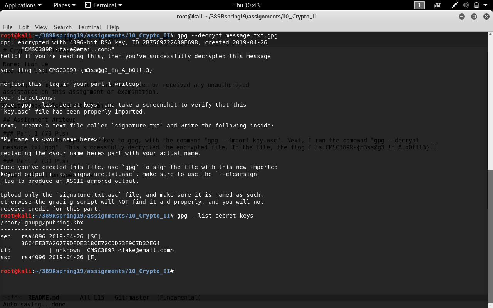

# Crypto II Writeup

Name: Tuan Le
Section: 0201

I pledge on my honor that I have not given or received any unauthorized
assistance on this assignment or examination.

Digital acknowledgement: Tuan Le

## Assignment Writeup

### Part 1 (70 Pts)

Firstly, I had to import the key to gpg, with the command 'gpg --import key.asc'. Next, I ran the command 'gpg --decrypt
message.txt.gpg'. This successfully decrypted the encrypted file. In the file, the flag I is CMSC389R-{m3ss@g3_!n_A_b0ttl3}.
I created a new file called 'signature.txt' using vim. In the file I typed 'My name is Tuan!'. I signed the file using 'gpg --output
signature.txt --sign signature.txt'. I then did 'gpg --clearsign signature.txt'. After this, I had to remove the file 'signature.txt'
so only the file 'signature.txt.asc' remains. 

The following is the result of running 'gpg --list-secret-keys`
/root/.gnupg/pubring.kbx
------------------------
sec   rsa4096 2019-04-26 [SC]
      86C4EE37A26779DFDE318CE72CDD23F9C7D32E64
uid           [ unknown] CMSC389R <fake@email.com>
ssb   rsa4096 2019-04-26 [E]

### Part 2 (30 Pts)
I ran both the given commands to encrypt the original.bmp image. The first command was in ECB mode and the second command was in CBC mode.
The original picture shows a stretched red oval in the middle and a small blue rectangle in the bottom right on a white background. The
ecb.bmp version stil has the outline of both shapes, but the circle is now a mix of colors, mostly reflects blue while the rectangle mostly reflects green. The background is no longer white. All the pixels seem to have changed color and it has a textured look to it. As for
the cbc.bmp version, it is just rectangle of random colors everywhere. It looks like nothing but just dots of every color scattered everywhere. No shapes or outlines can be distinguished at all. Obviously, this is the more secure image becuase nothing can be interpreted. The ecb ciper mode is less secure because you can still distinguish the outlines of the shapes, which gives away information. This is because in CBC, an initialization vector is used and the results of the block cipher encryption in one node are used in the next node. Each block is XORed with the previous ciphertext before being encrypted. This creates a dependency between blocks. IN ECB, each node is essentially separate. There is a lack of diffusion as it encripts identical plaintext blocks into identical ciphertext blocks. This does not hide data patterns well.

